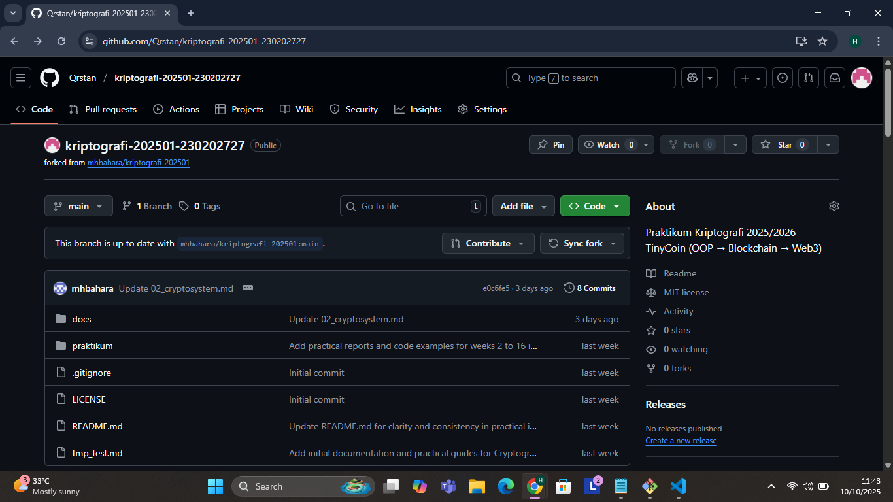

# Laporan Praktikum Kriptografi
Minggu ke-: 1  
Topik: intro CIA  
Nama: Hartanti  
NIM: 230202727  
Kelas: 5IKRA  

  Kriptografi adalah ilmu dan seni untuk menjaga keamanan informasi melalui teknik pengkodean (enkripsi) dan pengubahan pesan menjadi bentuk yang tidak dapat dipahami oleh pihak yang tidak berwenang. sejak jaman kuno hingga era digital modern, kriptografi terus berkembang menyesuaikan kebutuhan perlindungan informasi. Era Kriptografi Klasik Pada masa ini, metode kriptografi masih sederhana, menggunakan teknik substitusi dan transposisi. Contohnya Caesar Cipher yang menggunakan huruf alfabet sejauh beberapa langkah, serta Vigenere Cippheer yang menggunakan kata kunci untuk mengenkripsi teks. Walau efektif di masanya, metode ini rentan terhadap analisis frekuensii sehingga mudah dipecahkan dengan teknologi saat ini.

  Era Kriptografi Modern Memasuki abad ke-20,muncul algoritma kriptografi berbasis matematika kompleks dan komputeriisasi. contohnya: -AES (Advanced Encryption Standard) sebagai standar enkripsi simestris. -RSA (Rivest-Shamir-Adleman) sebagai algoritma enkripsi asimetris yang menggunakan pasangan kunci publik dan privat. kriptografi modern lebih aman karena melibatkan kunci panjang dan operasi matematis yang sulit dibalikkan. Era Kriptografi Kontemporer di era saat ini, kriptografi menjadi fondasi utama dalam berbagai teknologi digital, seperti: -Blockchain yang mendasari cryptocurrency (Bitcoin, Ethereum) -Digital signature untuk otentikasi dokumen elektronik. -Riset terbaru menuju kriptografi kuantum dan zero-knowledge proof, yang menjanjikan tingkat keamanan lebih tinggi di masa depan. Di era digital saat ini, kriptografi memiliki peran penting dalam berbagai aspek kehidupan sehari-hari, terutama terkait dengan komunikasi, transaksi online, dan perlindungan data diri digital. Hampir semua aktivitas berbasis internet memanfaatkan kriptografi, baik secara langsung maupun tidak langsung. Dalam bidang keamanan informasi, ada 3 prinsip-prinsip kriptografi modern yang menjadi dasar dalam merancang dan mengevaluasi keamanan sistem informasi:

Confidentiality (Kerahasiaan) yang dimana tugasnya untuk melindungi kerahasiaan data dan hanya penerima yang sah yang dapat memahami pesan yang dienkripsi. Tujuanya untuk mencegah kebocoran informasi kepada pihak yang tidak berhak. Misalnya:
- End-to-end encryption atau enkripsi data pada WhatsApp
- Penggunaan password, PIN, atau autentikasi biometrik.
- Pengaturan akses berbasis role (role-based access control).

Integrity (integritas) yang dimana untuk menjaga keaslian dan keutuhan data, data tidak boleh diubah selama transmisi tanpa deteksi. Integrity memastikan bahwa data tetap akurat, konsisten, dan tidak berubah tanpa otorisasi. Perubahan data hanya boleh dilakukan oleh pihak yang memiliki izin. Tujuanya untuk menjamin bahwa informasi tetap asli dan belum dimodifikasi secara ilegal. contoh integrity:
- Tanda tangan digital.
- Hash function (misalnya SHA-256) unntuk verifikasi file.
- Sistem kontrol versi (misalnya Git) untuk melacak perubahan.

Availability (Ketersediaan) untuk memastikan data/layanan tersedia saat dibutuhkan. Availability memastikan bahwa data dan layanan selalu tersedia ketika dibutuhkan oleh pihak yang berwenang. Sistem harus mampu memberikan layanan meskipun ada gangguan, serangan, atau kegagalan teknis. Tujuanya untuk menjamin pengguna sah dapat mengakses data dan layanan kapan pun diperlukan. Contoh Availability:
- Server dengan sistem backup dan failover.
- Penggunaan firewall dan sistem anti-DDos.
- Maintenance server secara rutin.

Peran Kriptografi dalam Kehidupan Sehari-hari:

1. Enkripsi WhatsApp (End-to-End Encryption) untuk melindungi pesan, panggilan suara, dan video. Cara kerjanya, setiap pesan dienkripsi di perangkat pengirim, hanya penerima yang memiliki kunci untuk men-endskripsinya. Manfaatnya yaitu:
- Mencegah pihak ketiga (termasuk WhatsApp sendiri) membaca pesan.
- Menjaga privasi komunikasi antar pengguna.
- Mengurangi risiko penyadapan.
2. SSL/TLS pada Web.Ketika kita mengakses situs web dengan protokol HTTPS, artinya komunikasi antar browser dan sever diamankan dengan protokol SSL/TLS. Contohnya adalah tanda gembok pada browser menunjukkan koneksi sudah aman. Fungsinya untuk:
- Melindungi data sensitif (misalnya password, data kartu kredit) agar tidak bocor.
- Menjamin integritas data yang dikirim dan diterima.
- Mengautentikasi identitas server sehingga pengguna tidak mudah tertipu oleh situs palsu (phhising).
3. Tanda Tangan Digital digunakan untuk menjamin keaslian dan integritas dokumen elektronik. Tanda tangan digital dibuat dengan algoritma kriptografi asimetris (RSA, ECDSA). Manfaatnya adalah :
- Menjamin bahwa dokumen benar-benar berasal dari pengirim yang sah.
- Memastikan dokumen tidak diuubah setelah ditandatangani.
- Digunakan dalam e-KTP, e-banking, hingga layanan e-government.
Kesimpulan
Konsep CIA (Confidentiality, Integrity, Availability) merupakan pilar utama dalam keamanan informasi. Kriptografi mendukung ketiga aspek tersebut melalui enkripsi, tanda tangan digital, dan berbagai mekanisme lain. Dalam kehidupan sehari-hari, penerapan kriptografi sangat penting untuk melindungi komunikasi, transaksi online, serta dokumen digital agar tetap aman dan terpercaya.

Quis:
Siapa tokoh yang dianggap sebagai bapak kriptografi modern?
Sebutkan algoritma kunci publik yang populer digunakan saat ini.
Apa perbedaan utama antara kriptografi klasik dan kriptografi modern?
jawab:

Tokoh yang dianggap sebagai bapak kriptografi modern adalah Claude Shannon. Ia dikenal sebagai Bapak Teori Informasi yang memperkenalkan konsep dasar keamanan informasi mellalui teori komunikasi matematis, khususnya dengan karyanya Communication Theory of Secrecy Systems. konsep inilah yang menjadi dasar perkembangan kriptografi modern.

Algoritma kunci publik yang populer digunakan saat ini: -RSA (Rivest-Shamir-Adlemen) -ECC (Elliptic Cuurve Cryptography) -EIGamal -DSA (Digital Signature Algorithm)

Perbedaan kriptografi klasik dan modern Kriptografi Klasik: -Menggunakan substitusi dan transposisi sederhana (caesar cipher, vigenere). -Mudah dipecahkan dengan analisis frekuensi dan komputasi sederhana. -Biasanya hanya menggunakan satu kunci untuuk enkripsi dan dekripsi -Dignakan pada komunikasi kuno Kriptografi Modern: -Menggunakan algoritma matematis kompleks dengan kunci panjang (AES, RSA) -Sulit dipecahkan karena membutuhkan kekuatan komputasi besar untuk brute force. -Menggunakan kunci simetris maupun asimetris -Digunakan pada teknologi modern (internet, perbankan, blockchain).

