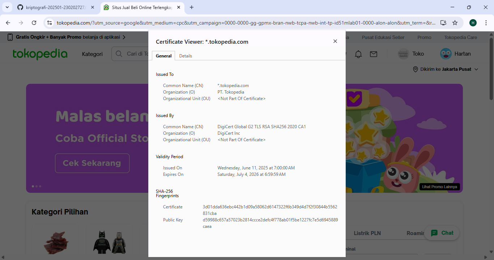
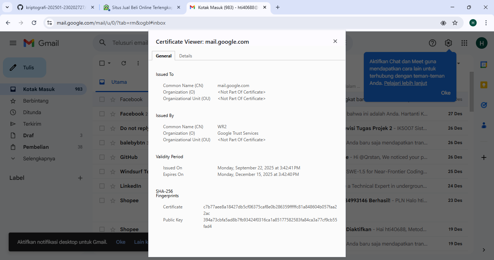

# Laporan Praktikum Kriptografi
Minggu ke-: XII  
Topik: Aplikasi TLS & E-commerce  
Nama: Hartanti  
NIM: 230202727  
Kelas: 5IKRA  

---

## 1. Tujuan
1. Menganalisis penggunaan kriptografi pada email dan SSL/TLS.
2. Menjelaskan enkripsi dalam transaksi e-commerce.
3. Mengevaluasi isu etika & privasi dalam penggunaan kriptografi di kehidupan sehari-hari.

---

## 2. Dasar Teori
## Ringkasan Teori Relevan TLS/SSL

TLS/SSL (Transport Layer Security / Secure Sockets Layer) merupakan protokol keamanan yang
digunakan untuk melindungi komunikasi data antara klien dan server melalui jaringan internet.
TLS/SSL bekerja dengan cara mengenkripsi data menggunakan algoritma kriptografi sehingga informasi
yang dikirim, seperti username, password, isi email, dan data transaksi, tidak dapat dibaca oleh
pihak yang tidak berwenang. Selain enkripsi, TLS/SSL juga menyediakan mekanisme autentikasi melalui
sertifikat digital yang dikeluarkan oleh Certificate Authority (CA) untuk memastikan keaslian
identitas server.

Dari sisi keamanan, penggunaan TLS/SSL mampu mencegah berbagai serangan seperti penyadapan data
(eavesdropping) dan serangan man-in-the-middle. Protokol TLS versi terbaru menawarkan algoritma
enkripsi yang lebih kuat serta proses handshake yang lebih aman, sehingga meningkatkan tingkat
kepercayaan pengguna terhadap layanan digital, khususnya pada sistem e-commerce dan layanan email
yang menangani data sensitif.

Namun, penerapan TLS/SSL juga berkaitan dengan isu etika dan privasi. Penyedia layanan memiliki
tanggung jawab etis untuk menggunakan sertifikat yang valid, memperbarui sistem keamanan secara
berkala, serta melindungi data pengguna dengan kebijakan privasi yang transparan. Meskipun TLS/SSL
melindungi data saat transmisi, privasi pengguna tetap bergantung pada bagaimana penyedia layanan
mengelola dan menyimpan data tersebut di sisi server.
---

## 3. Alat dan Bahan
(- Python 3.x  
- Visual Studio Code / editor lain  
- Git dan akun GitHub  
- Library tambahan (misalnya pycryptodome, jika diperlukan)  )

---

## 4. Langkah Percobaan
(Tuliskan langkah yang dilakukan sesuai instruksi.  
Contoh format:
1. Langkah 1 — Analisis SSL/TLS pada Email & Web
2. Langkah 2 — Studi Kasus E-commerce
3. Langkah 3 — Analisis Etika & Privasi
)

---

## 5. Langkah demi Langkah
(Analisis SSL/TLS dilakukan menggunakan browser Google Chrome dengan mengecek sertifikat digital
pada website e-commerce dan layanan email. Pemeriksaan dilakukan melalui ikon gembok pada address
bar untuk melihat informasi sertifikat yang digunakan.

### Informasi Sertifikat Digital

**Website E-Commerce (Tokopedia)**
- Issuer CA (Certificate Authority): DigiCert Global G2 TLS RSA SHA256 2020 CA1
- Otoritas Sertifikat: DigiCert Inc
- Masa Berlaku Sertifikat:
  - Mulai: 11 Juni 2025
  - Berakhir: 4 Juli 2026
- Algoritma Enkripsi:
  - Algoritma kunci publik: RSA
  - Algoritma hash: SHA-256
  - Enkripsi data: AES (digunakan pada sesi TLS)

**Layanan Email (Gmail)**
- Issuer CA (Certificate Authority): Google Trust Services (WR2)
- Masa Berlaku Sertifikat:
  - Mulai: 22 September 2025
  - Berakhir: 15 Desember 2025
- Algoritma Enkripsi:
  - Algoritma kunci publik: RSA
  - Algoritma hash: SHA-256
  - Enkripsi data: AES (digunakan pada sesi TLS)

### Perbandingan Website HTTPS dan Tanpa HTTPS

Website yang menggunakan HTTPS dengan SSL/TLS mampu mengenkripsi data yang dikirimkan antara
pengguna dan server sehingga informasi tidak dapat dibaca atau diubah oleh pihak yang tidak
berwenang. Selain itu, HTTPS menyediakan autentikasi server melalui sertifikat digital yang
meningkatkan kepercayaan pengguna.

Sebaliknya, website tanpa HTTPS (HTTP) tidak menggunakan enkripsi, sehingga data yang dikirimkan
dapat dengan mudah disadap atau dimanipulasi oleh pihak ketiga. Hal ini membuat website tanpa HTTPS
tidak aman untuk digunakan, terutama untuk aktivitas yang melibatkan data sensitif seperti login
dan transaksi online.

## Studi Kasus Penerapan SSL/TLS pada E-Commerce

Pada platform e-commerce, SSL/TLS digunakan untuk melindungi seluruh proses transaksi online,
terutama saat pengguna melakukan login dan pembayaran. Ketika pengguna memasukkan username,
password, atau data pembayaran, informasi tersebut dienkripsi menggunakan protokol TLS sebelum
dikirimkan ke server. Enkripsi ini memastikan bahwa data sensitif tidak dapat dibaca atau diubah
oleh pihak ketiga selama proses transmisi. Selain itu, sertifikat digital yang valid membantu
memastikan bahwa pengguna terhubung ke website e-commerce yang asli dan terpercaya.

Pada proses pembayaran, SSL/TLS berperan penting dalam menjaga kerahasiaan informasi finansial
seperti nomor kartu, detail akun, dan riwayat transaksi. Dengan adanya enkripsi TLS, data transaksi
hanya dapat didekripsi oleh server yang memiliki kunci yang sah, sehingga meningkatkan keamanan
dan kepercayaan konsumen dalam melakukan transaksi online.

Jika TLS tidak digunakan, berbagai ancaman keamanan dapat terjadi, salah satunya adalah serangan
Man-in-the-Middle (MITM). Pada serangan ini, penyerang dapat menyadap atau memodifikasi data yang
dikirim antara pengguna dan server tanpa disadari oleh pengguna. Akibatnya, data login dan
informasi pembayaran dapat dicuri atau disalahgunakan. Selain itu, tanpa TLS, pengguna juga
berisiko terhubung ke website palsu yang meniru tampilan e-commerce asli, sehingga meningkatkan
risiko penipuan dan pencurian data.

## Analisis Etika dan Privasi pada Komunikasi Email Terenkripsi

Penggunaan email terenkripsi seperti PGP (Pretty Good Privacy) dan S/MIME bertujuan untuk menjaga
kerahasiaan dan integritas isi pesan agar hanya dapat dibaca oleh pengirim dan penerima yang sah.
Meskipun demikian, isu privasi tetap muncul karena pengelolaan kunci enkripsi menjadi faktor
krusial. Jika kunci privat disimpan atau dikelola oleh pihak ketiga, seperti penyedia layanan email
atau organisasi tempat pengguna bekerja, maka potensi pelanggaran privasi dapat terjadi.

Dari sisi dilema etika, muncul pertanyaan apakah perusahaan memiliki hak untuk mendekripsi email
karyawan demi kepentingan audit dan keamanan internal. Secara etis, tindakan tersebut dapat
dibenarkan apabila dilakukan secara terbatas, transparan, dan sesuai dengan kebijakan yang telah
disepakati sebelumnya oleh karyawan. Namun, tanpa persetujuan dan batasan yang jelas, dekripsi
email karyawan dapat melanggar hak privasi individu dan menurunkan kepercayaan terhadap organisasi.

Selain itu, kebijakan pemerintah dalam pengawasan komunikasi terenkripsi juga menimbulkan dilema
etika dan privasi. Di satu sisi, pemerintah berkepentingan untuk menjaga keamanan nasional dan
mencegah kejahatan siber. Di sisi lain, pengawasan berlebihan atau kewajiban menyediakan akses
dekripsi (backdoor) dapat melemahkan keamanan sistem enkripsi dan mengancam privasi masyarakat.
Oleh karena itu, diperlukan keseimbangan antara kepentingan keamanan publik dan perlindungan hak
privasi dalam pengawasan komunikasi terenkripsi.

)

---

## 6. Hasil dan Pembahasan
(Screenshot Info TLS/SSL

)

---

## 7. Jawaban Pertanyaan
(Jawab pertanyaan diskusi yang diberikan pada modul.  
- Pertanyaan 1: Perbedaan utama antara HTTP dan HTTPS adalah pada tingkat keamanannya. HTTP tidak menggunakan enkripsi sehingga data yang dikirim antara pengguna dan server dapat dengan mudah disadap atau dimanipulasi oleh pihak lain, sedangkan HTTPS menggunakan protokol SSL/TLS untuk mengenkripsi data sehingga komunikasi menjadi lebih aman dan terlindungi.

- Pertanyaan 2: Sertifikat digital penting dalam komunikasi TLS karena berfungsi untuk memverifikasi identitas server dan membangun kepercayaan antara pengguna dan server, sehingga pengguna dapat memastikan bahwa koneksi yang digunakan aman dan terhindar dari serangan penyamaran atau man-in-the-middle.

- Pertanyaan 3: Kriptografi mendukung privasi dalam komunikasi digital dengan mengenkripsi data sehingga hanya pihak yang berwenang yang dapat membaca isi komunikasi, namun pada saat yang sama menimbulkan tantangan hukum dan etika karena enkripsi dapat membatasi akses penegak hukum untuk kepentingan pengawasan dan penegakan hukum, serta memunculkan dilema antara perlindungan privasi individu dan kebutuhan keamanan publik.  
)

---

## 8. Kesimpulan
(Berdasarkan percobaan, SSL/TLS terbukti berperan penting dalam mengamankan komunikasi digital melalui enkripsi dan autentikasi sertifikat digital. Penggunaan TLS pada layanan email dan e-commerce mampu melindungi data sensitif dari penyadapan dan serangan pihak ketiga. Oleh karena itu, penerapan SSL/TLS menjadi kebutuhan utama untuk menjaga keamanan dan kepercayaan pengguna di internet.  )

---

