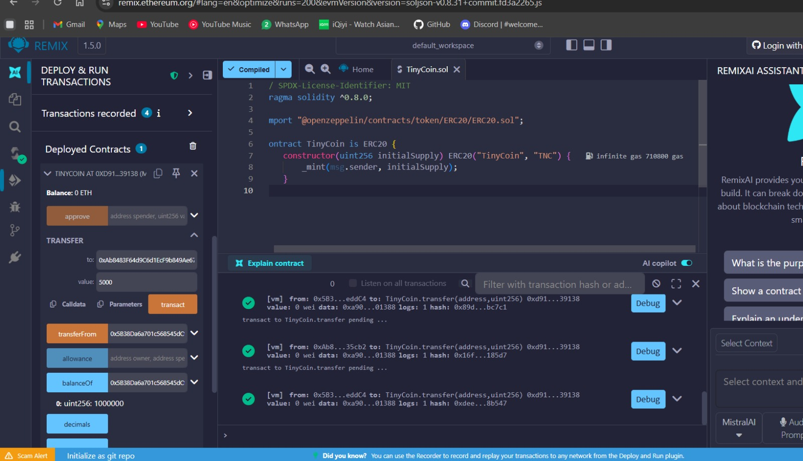

# Laporan Praktikum Kriptografi
Minggu ke-: XV  
Topik: Proyek Kelompok – TinyCoin ERC20  
Nama: Hartanti  
NIM: 230202727  
Kelas: 5IKRA  

---

## 1. Tujuan
1. Mengembangkan proyek sederhana berbasis algoritma kriptografi.
2. Mendokumentasikan proses implementasi proyek ke dalam repository Git.
3. Menyusun laporan teknis hasil proyek akhir.

---

## 2. Dasar Teori
(
    Blockchain merupakan teknologi buku besar terdistribusi yang menyimpan data transaksi secara permanen dan tidak dapat diubah (immutable). Keamanan blockchain didukung oleh algoritma kriptografi, khususnya fungsi hash dan tanda tangan digital, yang menjamin integritas data, autentikasi pengguna, dan non-repudiation. Dalam jaringan Ethereum, setiap transaksi dan eksekusi smart contract divalidasi secara kriptografis oleh node jaringan.

    Smart contract adalah program yang berjalan di atas blockchain dan akan dieksekusi secara otomatis ketika kondisi tertentu terpenuhi. Standar ERC20 merupakan spesifikasi teknis yang mendefinisikan bagaimana sebuah token digital dapat dibuat dan digunakan dalam ekosistem Ethereum, termasuk fungsi-fungsi dasar seperti transfer, balanceOf, dan totalSupply. Standar ini memastikan interoperabilitas token dengan wallet, exchange, dan aplikasi terdesentralisasi (DApps).

    TinyCoin adalah token ERC20 sederhana yang diimplementasikan untuk memahami bagaimana kriptografi dan blockchain bekerja dalam sistem keuangan digital. Dengan memanfaatkan Solidity dan library OpenZeppelin, pengembang dapat membuat kontrak yang aman, efisien, dan mengikuti praktik terbaik dalam pengembangan smart contract.
  )

---

## 3. Alat dan Bahan
(- Solidity (versi ^0.8.x)  
- Remix IDE (berbasis web)  
- Browser (Chrome/Firefox)  
- Git dan akun GitHub
- Library OpenZeppelin ERC20  )

---

## 4. Langkah Percobaan
( 
1. Membuat folder proyek praktikum/week15-tinycoin-erc20/ sesuai struktur yang ditentukan.
2. Membuat file contracts/TinyCoin.sol di dalam folder contracts.
3. Menuliskan kode smart contract TinyCoin menggunakan standar ERC20 dari OpenZeppelin.
4. Membuka Remix IDE dan menyalin kode TinyCoin.sol ke dalam editor Remix.
5. Melakukan kompilasi kontrak menggunakan Solidity Compiler versi ^0.8.0.
6. Melakukan deployment kontrak menggunakan JavaScript VM atau testnet Ethereum.
7. Mencatat alamat kontrak hasil deployment.
8. Menguji fungsi balanceOf, transfer, dan totalSupply melalui Remix.
9. Mengambil screenshot hasil deployment dan transaksi token.
10. Menyimpan semua file dan melakukan commit ke Git dengan pesan week15-tinycoin-erc20.)

---

## 5. Source Code
(
// SPDX-License-Identifier: MIT
pragma solidity ^0.8.0;

import "@openzeppelin/contracts/token/ERC20/ERC20.sol";

contract TinyCoin is ERC20 {
    constructor(uint256 initialSupply) ERC20("TinyCoin", "TNC") {
        _mint(msg.sender, initialSupply);
    }
}
)

---

## 6. Hasil dan Pembahasan
( Setelah kontrak TinyCoin berhasil dikompilasi dan di-deploy, sistem menghasilkan sebuah alamat kontrak unik di jaringan Ethereum. Pada saat deployment, jumlah token awal (initialSupply) secara otomatis dicetak (mint) dan diberikan kepada alamat wallet yang melakukan deployment kontrak.

Pengujian dilakukan dengan memanggil fungsi balanceOf untuk memastikan bahwa deployer menerima seluruh token awal. Selanjutnya, fungsi transfer digunakan untuk mengirim sebagian token ke alamat lain. Setelah transaksi berhasil, saldo pengirim dan penerima berubah sesuai dengan jumlah token yang ditransfer, sedangkan nilai totalSupply tetap sama, menunjukkan bahwa tidak terjadi pencetakan atau penghapusan token yang tidak sah.

Hasil pengujian ini menunjukkan bahwa kontrak TinyCoin telah berfungsi sesuai dengan standar ERC20. Solidity versi 0.8 ke atas juga secara otomatis mencegah integer overflow dan underflow, sehingga perhitungan saldo lebih aman. Screenshot hasil deployment dan transaksi disimpan pada folder screenshots/.

)

---

## 7. Jawaban Pertanyaan
(Jawab pertanyaan diskusi yang diberikan pada modul.  
- Pertanyaan 1: ERC20 berfungsi sebagai standar teknis untuk pembuatan token di jaringan Ethereum sehingga token dapat digunakan secara konsisten oleh berbagai aplikasi seperti wallet, exchange, dan smart contract lainnya. Dengan adanya ERC20, token dari berbagai proyek dapat saling kompatibel dan mudah diintegrasikan. 

- Pertanyaan 2: Ketika fungsi transfer(address, amount) dipanggil, kontrak akan mengurangi saldo pengirim dan menambah saldo penerima sesuai jumlah token yang ditransfer. Transaksi ini divalidasi oleh jaringan blockchain dan dicatat secara permanen sehingga tidak dapat diubah.

- Pertanyaan 3: Risiko utama meliputi bug kode, reentrancy attack, dan kesalahan logika yang dapat menyebabkan kehilangan aset. Mitigasinya dilakukan dengan menggunakan library terpercaya seperti OpenZeppelin, menerapkan versi Solidity terbaru, serta melakukan audit dan pengujian sebelum kontrak digunakan di jaringan publik.  
)
---

## 8. Kesimpulan
(Berdasarkan praktikum yang dilakukan, smart contract TinyCoin ERC20 berhasil diimplementasikan dan diuji dengan baik. Fungsi dasar seperti pencetakan token awal, pengecekan saldo, dan transfer token berjalan sesuai standar. Proyek ini menunjukkan bagaimana kriptografi dan blockchain dapat digunakan untuk membangun sistem aset digital yang aman dan terdesentralisasi. )

---

## 9. Daftar Pustaka
(Cantumkan referensi yang digunakan.  
Contoh:  
- Stallings, W. (2017). Cryptography and Network Security: Principles and Practice.  
- Stinson, D. R. (2019). Cryptography: Theory and Practice.  
- OpenZeppelin. ERC20 Token Standard Documentation. 
)