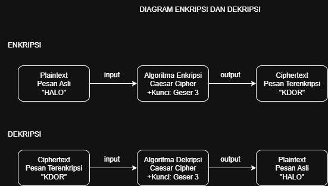

# Laporan Praktikum Kriptografi
Minggu ke-: 2  
Topik: Cryptosystem 
Nama: Hartanti  
NIM: 230202727  
Kelas: 5IKRA  

---

## 1. Tujuan
1.Mengidentifikasi komponen dasar kriptosistem (plaintext, ciphertext, kunci, algoritma).
2.Menggambarkan proses enkripsi dan dekripsi sederhana.
3.Mengklasifikasikan jenis kriptosistem (simetris dan asimetris).

## 2. Dasar Teori
Komponen Kriptosistem
Kriptosistem adalah metode yang diterapkan untuk melindungi data dengan cara menerapkan teknik enkripsi dan dekripsi. Secara umum, kriptosistem terdiri dari lima elemen inti. Plaintext merujuk pada pesan atau data asli yang perlu dilindungu, sedangkan ciphertext merupakan hasil dari enkripsi plaintext yang tidak bisa dibaca tanpa adanya knci yang tepat. Proses enkripsi dilakukan melalui algoritma matematis yang mengkonversi plaintext menjadi ciphertext, sementara algoritma dekripsi berfungsi untuk mengembalikan ciphertext menjadi plaintext yang asli. Elemen paling penting dalam kriptosistem adalah kunci, yakni parameter yang bersifat rahasia dan digunakan dalam proses enkripsi serta dekripsi. Kunci ini menentukan cara plaintxt diproses menjadi ciphertext dan sebaliknya.
# 3 Perbedaan Kriptografi Simetris dan Asimetris
Kriptografi Simetris 
Kriptografi simetris memanfaatkan kunci yang sama untuk melakukan enkripsi dan dekripsi. Baik pengirim maupun penerima harus memiliki kunci yang sama dan memastikan kunci tersebut tetap terlindungi.
Contoh Algoritma:
1. AES (Standar Enkripsi Lanjutan)
-Biasa diterapkan untuk: enkripsi berkas, komunikasi VPN, penyimpanan data.
2. DES (Standar Enkripsi Data)
-Sudah banyak digantikan oleh AES dalam beragam aplikasi.

Kriptografi Asimetris
Kriptografi asimetris memanfaatkan dua kunci yang berbeda: satu kunci publik untuk proses enkripsi dan satu kunci privat untuk dekripsi (atau sebaliknya untuk keperluan tanda tangan digital).
Contoh Algoritma:
1. RSA (Rivest-Shamir-Adleman)
-Digunakan untuk: pertukaran kunci, tanda tangan digital, SSL/TLS.
2. ECC (Elliptic Curve Cryptography)
-Diterapkan dalam: Bitcoin, sistem pembayaran terkini, komunikasi seluler.

# Jawaban pertanyaan diskusi
1. Komponen Utama dalam Kriptosistem:
-Plaintext (Teks Asli)
-Ciphertext (Teks Tersandi)
-Kunci (Key)
-Algoritma Enkripsi
-Algoritma Dekripsi
-Keyspace (Ruang Kunci)

2. kriptografi simetris memiliki kelebihan yaitu proses enkripsi dan dekripsinya lebih cepat karena menggunakan satu kunci yang sama, namun kelemahannya adalah keamanan kunci sulit dijaga karena harus dibagikan kepada kedua pihak. Sedangkan sistem asimetris lebih aman karena menggunakan dua kunci berbeda (publik dan privat), tetapi memiliki proses yang lebih lambat dibandingkan sistem simetris.

3. Distribusi kunci menjadi tantangan utama dalam kriptografi simetris karena kedua belah pihak perlu memiliki kunci yang identik, dan pengiriman kunci itu harus dilakukan dengan aman. Apabila kunci tersebut berhasil diambil atau disadap oleh pihak ketiga, maka seluruh pesan yang terenkripsi bisa diakses dan dibaca, yang mengakibatkan keamanan sistem dapat terganggu.
   

