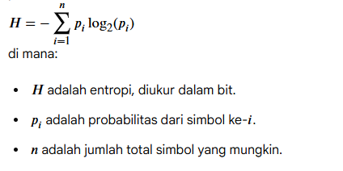
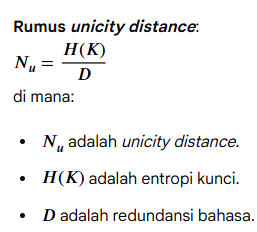

# Laporan Praktikum Kriptografi
Minggu ke-: 4  
Topik: Entropy & Unicity Distance  
Nama: Hartanti  
NIM: 230202727  
Kelas: 5IKRA  

---

## 1. Tujuan
1. Menyelesaikan perhitungan sederhana terkait entropi kunci.
2. Menggunakan teorema Euler pada contoh perhitungan modular & invers.
3. Menghitung unicity distance untuk ciphertext tertentu.
4. Menganalisis kekuatan kunci berdasarkan entropi dan unicity distance.
5. Mengevaluasi potensi serangan brute force pada kriptosistem sederhana.

---

## 2. Dasar Teori
A. Entropi dalam konteks kriptografi, adalah ukuran ketidakpastian atau keacakan dalam suatu sistem. semakin tinggi nilai entropi, semakin besar ketidakpastianya. Entropi mengukur jumlah rata-rata informasi yang dikandung oleh sumber pesan, atau dengan kata lain, mengukur tingkat ketidaktentuan (uncertainty) atau kekacauan.
Rumus Dasar (Entropi Shannon): Untuk variabel acak diskrit *X* dengan nilai X1,X2,...,Xn dan probabilitas *P*(Xi): 
relevansi dalam kriptografi:
1. Kunci (Key Entropi): Entropi ruang kunci (H(K)) mengukur seberapa acak dan tidak pasti kunci tersebut.
2. Keacakan: Konsep entropi digunakan dalam perancangan True Random Number Generators (TRNG), yang menghasilkan bit acak dari sumber fisik (seperti noise elektronik), karena entropi yang tinggi menunjukkan keacakan sejati.

B. Unicity distance adalah jumlah minimal karakter ciphertext yang dibutuhkan untuk secara teoritis menentukan kunci enkripsi secara unik oleh seorang penyerang. Jika penyerang memiliki lebih banyak karakter ciphertext daripada unicity distance, kunci yang benar akan muncul sebagai satu-satunya solusi yang masuk akal, karena semua kunci salah lainnya akan menghasilkan plaintext yang tidak bisa dibaca (tidak masuk akal).

implikasi keamanan:
- Jika ciphertext lebih pendek dari n0, mungkin ada lebih dari satu kunci yang dapat mendekripsi ciphertext menjadi plaintext yang terlihat masuk akal, sehingga kunci tidak dapat ditentukan secara unik.
- Jika ciphertext lebih panjang dari n0, secara teoritis hanya ada satu kunci yang benar.
---

## 3. Alat dan Bahan
(- Python 3.x  
- Visual Studio Code / editor lain  
- Git dan akun GitHub  
- Library tambahan (misalnya pycryptodome, jika diperlukan)  )

---

## 4. Langkah Percobaan
1. Membuat file `entropy_unicity.py` di folder `praktikum/week4-entropy-unicity/src/`.
2. Menyalin kode program dari panduan praktikum.
3. Menjalankan program dengan perintah `python entropy_unicity.py`.

---

## 5. Source Code
(Salin kode program utama yang dibuat atau dimodifikasi.  
Gunakan blok kode:

```python
# contoh potongan kode
def unicity_distance(HK, R=0.75, A=26):
    return HK / (R * math.log2(A))

HK = entropy(26)
print("Unicity Distance untuk Caesar Cipher =", unicity_distance(HK))
```
)

---

## 6. Hasil dan Pembahasan
(- Lampirkan screenshot hasil eksekusi program (taruh di folder `screenshots/`).  
- Berikan tabel atau ringkasan hasil uji jika diperlukan.  
- Jelaskan apakah hasil sesuai ekspektasi.  
- Bahas error (jika ada) dan solusinya. 

Hasil eksekusi program Caesar Cipher:


)

---

## 7. Jawaban Pertanyaan
(Jawab pertanyaan diskusi yang diberikan pada modul.  
- Pertanyaan 1: Nilai entropi dalam konteks kekuatan kunci (kriptografi) adalah ukuran dari tingkat keacakan (randomness) dan ketidakpastian (uncertainty) dari kunci tersebut, yang secara langsung mencerminkan kekuatan teoritis kunci dalam menahan serangan brute force (coba-coba semua kemungkinan kunci).  
- Pertanyaan 2: Unicity distance ($n_0$) penting dalam menentukan keamanan suatu cipher (sistem enkripsi) karena ia memberikan ukuran teoritis mengenai jumlah minimum ciphertext yang harus diamati oleh penyerang sebelum kunci yang benar dapat ditentukan secara unik.Ini adalah batas kritis yang memisahkan antara kondisi ambiguitas kunci dan kondisi determinasi kunci.
- Pertanyaan 3: Brute force masih menjadi ancaman yang signifikan meskipun algoritma kriptografi (seperti AES atau RSA) sudah kuat, karena serangan brute force sebagian besar menargetkan kelemahan pada implementasi dan faktor manusia, bukan kelemahan matematis pada algoritma itu sendiri. algoritma yang kuat hanya sekuat kunci yang melindunginya dan mekanisme pembatasan yang diterapkan pada sistem. 
)
---

## 8. Kesimpulan
Caesar Cipher memiliki keamanan yang sangat rendah karena entropi dan unicity distance kecil serta waktu brute force singkat. Sebaliknya, algoritma modern seperti AES-128 memiliki entropi sangat tinggi dan tahan terhadap serangan brute force, sehingga jauh lebih aman digunakan.

---